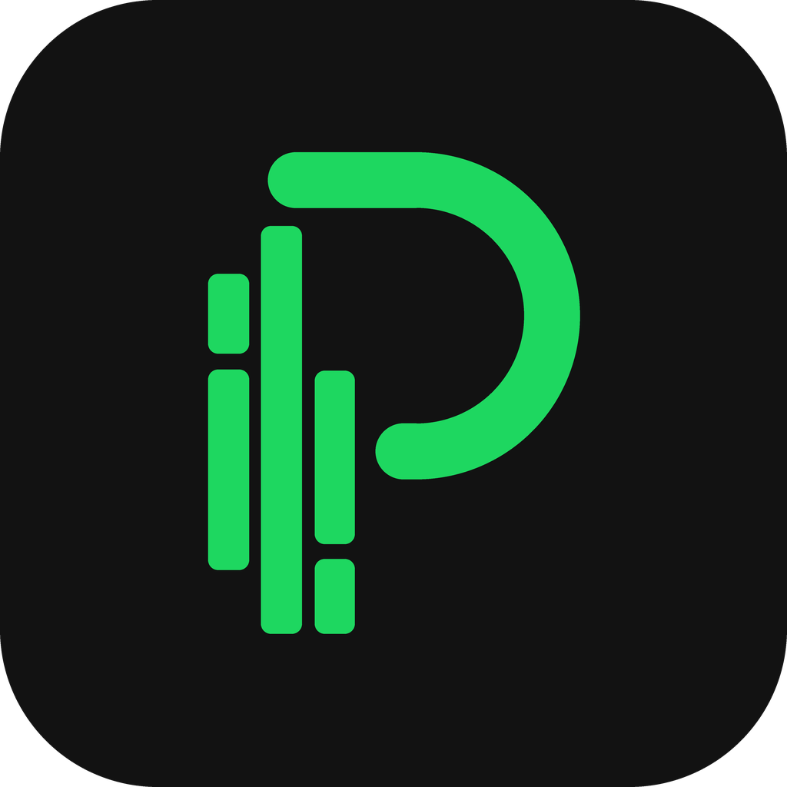

<p align="center">
  
</p>

<h1 align="center">spotipulse</h1>

<p align="center">A terminal dashboard for your Spotify stats — now playing, top tracks & artists, listening history.</p>

<p align="center">
  
  
</p>

---

**spotipulse** puts your Spotify listening in a fast, keyboard-driven terminal dashboard. Spotify's API only
gives you three fixed windows (4 weeks, 6 months, 1 year), so spotipulse also keeps a **local history** of what
you play. That's what powers the day-by-day graph, listening streaks and week-over-week comparisons that
tools which only wrap the API can't show.

## Features

- **Startup splash**: the logo in green block art
- **Now Playing**: title, artist, album and release year, the real cover art in your terminal, a live
  progress bar, where it's playing from ("From playlist Chill Vibes"), the device and its volume,
  shuffle/repeat state, and the next 5 tracks in your queue (refreshes every ~3 s)
- **Top**: top 50 tracks and top 50 artists for **4 Weeks / 6 Months / 1 Year**, with a **trend** column
  (▲ climbed, ▼ dropped, NEW) comparing each period with the next longer one, cover/avatar preview,
  type-to-filter search and an estimated listening time for the period
- **Genres**: bar chart of your top genres, built from your top 50 artists
- **History**: day-by-day listening graph from the local database, current and longest streak,
  last 7/30 days compared with the 7/30 days before
- **Recently Played**: your last 50 tracks with timestamps and cover art
- **Profile**: your name and avatar, liked songs, saved albums, playlists and followed artists counts,
  your favorite track/artist/genre of the last 4 weeks and last year, and your playlists
- **Export recap**: press `e` to save a Wrapped-style PNG card (1080×1350) of the selected period: your
  #1 track with its cover, top 5 tracks and artists with their artwork, top genres and listening time, on a
  background tinted by your #1 cover
- **Compact view**: press `c` (or start with `spotipulse --mini`) for just what's playing, readable in a tiny
  terminal window
- **Adapts to your window**: panels, covers and table columns resize or step aside as the terminal gets
  narrower or shorter; tabs that no longer fit scroll
- **Instant start**: the last tops, profile, recently played list and covers are kept on disk, shown
  immediately at launch, then refreshed in the background
- **Help**: press `?` for every keyboard shortcut
- Spotify-green theme, rounded panels, full keyboard and mouse support

## Screenshot

> _Screenshot / terminal recording coming soon._

## Requirements

- Python **3.11+**
- A Spotify account
- A Spotify Developer app (free, takes 2 minutes, see below)

## Spotify Developer app setup

1. Go to [developer.spotify.com/dashboard](https://developer.spotify.com/dashboard) and click **Create app**.
2. Give it any name and description. Under **Redirect URIs**, add exactly:

   ```
   http://127.0.0.1:8888/callback
   ```

   It must match character for character: `127.0.0.1`, not `localhost`, with no trailing slash.

   Reusing an existing app that already has another redirect URI (for example port `8899`)? Either add the
   URI above to it, or set `redirect_uri` in `~/.config/spotipulse/config.toml` to the one it already has.
3. Under **Which API/SDKs are you planning to use?**, tick **Web API**, then save.
4. Open the app's **Settings** and copy the **Client ID** and **Client Secret**.
   spotipulse asks for them the first time you run it.

> **Important — Spotify's Development Mode rules (2026):**
> - the account that owns the app needs an active **Spotify Premium** subscription;
> - every account that logs in (including yours) must be added in the app's **User Management** tab
>   (name + the email of the Spotify account), up to 5 users;
> - you must be logged into that same Spotify account in your browser when you approve.

## Installation

1. Check that you have Python 3.11 or newer:

   ```bash
   python --version        # Windows: py -3.11 --version
   ```

2. Install [pipx](https://pipx.pypa.io) if you don't have it yet:

   ```bash
   python -m pip install --user pipx
   python -m pipx ensurepath
   ```

   On Windows, use `py -3.11` in place of `python` if `python --version` shows an older version.

   `ensurepath` adds pipx's command folder (`~/.local/bin`, or `C:\Users\<you>\.local\bin` on Windows) to
   your `PATH`. **Close every terminal and open a new one** so it takes effect. In VS Code, restart VS Code
   itself: its terminals keep the old `PATH` until then.
3. Clone and install spotipulse:

   ```bash
   git clone https://github.com/quelquun667/spotipulse.git
   cd spotipulse
   pipx install .
   ```

   If `pipx` isn't found yet, use `python -m pipx install .` (or `py -3.11 -m pipx install .`).
4. Run it from any directory, just by its name:

   ```bash
   spotipulse
   ```

`pipx` installs spotipulse in its own isolated environment and puts the `spotipulse` command on your `PATH`.
You don't need to activate a virtualenv, and the command works from any folder.

### Updating

`pipx install .` copies the code at the moment you run it. After pulling new changes (or editing the code),
reinstall:

```bash
cd spotipulse
git pull
pipx install . --force
```

### Uninstalling

```bash
pipx uninstall spotipulse
```

Your config, login and history in `~/.config/spotipulse/` are kept. Delete that folder too for a clean slate.

<details>
<summary>Development install</summary>

```bash
python -m venv .venv
source .venv/bin/activate      # Windows: .venv\Scripts\activate
pip install -e ".[dev]"
pytest
ruff check src tests
```

</details>

## First run

The first time you type `spotipulse`:

1. It tells you you're not connected and asks **Open the browser to log in now? [Y/n]**.
2. It asks for your **Client ID** and **Client Secret** (the secret is hidden as you type). They're saved to
   `~/.config/spotipulse/config.toml`.
3. Your browser opens on Spotify's consent page. Approve it, and the dashboard starts.

spotipulse asks for read-only permissions: what's playing and your playback state, your top items and
recently played tracks, and your library, playlists and followed artists (for the Profile tab). It never
changes anything in your account. After an update that needs a new permission, it asks you to log in once
more.

After that, `spotipulse` goes straight to the dashboard and refreshes your login silently in the background.
Spotify logins expire 6 months after you first approve the app. When that happens, spotipulse says so and
opens the browser again.

Everything lives in `~/.config/spotipulse/`, outside the repository:

| File           | What it is                                           |
| -------------- | ---------------------------------------------------- |
| `config.toml`  | your Client ID/Secret and settings (see [Settings](#settings)) |
| `token_cache`  | your Spotify login token                             |
| `history.db`   | your local listening history (SQLite)                |
| `cache/`       | last fetched data and covers, for an instant start (safe to delete) |

> **About local history:** spotipulse logs a track once you've listened to it for 30 seconds **while
> spotipulse is open**. Leave it running on the Now Playing tab and the History tab fills up over time.

## Usage

```
spotipulse               launch the dashboard
spotipulse --logout      forget your Spotify login
spotipulse --no-splash   skip the startup logo
spotipulse --mini        start in the compact view
spotipulse --version     print the version
```

### Keybindings

| Key               | Action                                               |
| ----------------- | ---------------------------------------------------- |
| `1` – `6`         | Now Playing / Top / Genres / History / Recently Played / Profile (on AZERTY, `&` `é` `"` `'` `(` `-` work too, no Shift needed) |
| `w` / `m` / `y`   | switch period: 4 Weeks / 6 Months / 1 Year           |
| `←` / `→`         | switch period (on the period tabs)                   |
| `/`               | filter top tracks & artists                          |
| `Esc`             | clear the filter                                     |
| `↑` / `↓`         | move through a table (updates the cover preview)     |
| `Tab`             | move focus between widgets                           |
| `c`               | compact view on / off                                |
| `?` or `,`        | show all keyboard shortcuts (`,` so AZERTY needs no Shift) |
| `r`               | refresh everything                                   |
| `e`               | export a PNG recap of the selected period            |
| `L` (Shift + l)   | log out and quit                                     |
| `q`               | quit                                                 |

Recap cards are saved to `~/Pictures`, or to your home folder if that doesn't exist. Set `export_dir` in
`config.toml` to change it (see [Settings](#settings)).

### Window size

spotipulse works from about 60×15 upwards. Below 140 columns the Top and Recently Played cover previews
step aside; below 100 columns the Top tables stack and the Now Playing cover hides; below 36 rows the header
and the "Up next" panel make room. For a very small window, use the compact view (`c`).

## Settings

All settings live in `~/.config/spotipulse/config.toml`, under `[app]`. Edit the file and restart
spotipulse. [`config.example.toml`](config.example.toml) shows the whole file.

| Setting | Default | What it does |
| ------- | ------- | ------------ |
| `covers` | `"blocks"` | how album art is drawn — see the table below |
| `refresh_interval` | `3` | seconds between "now playing" refreshes (minimum 1) |
| `export_dir` | `~/Pictures` | where `e` saves recap cards; falls back to your home folder |

```toml
[app]
covers = "blocks"
refresh_interval = 3
export_dir = "~/Pictures"
```

The `[spotify]` section holds your `client_id`, `client_secret` and `redirect_uri`. spotipulse writes it for
you on first run; you only touch it to change the redirect URI or to use another Spotify app.

### Album art: the `covers` setting

| Value | What you get | When to use it |
| ----- | ------------ | -------------- |
| `"blocks"` **(default)** | Cover art drawn with colored half-block characters. Plain text, so it can never leave anything behind on screen. | Everywhere. Recommended on Windows Terminal. |
| `"auto"` | Real images through your terminal's graphics protocol (Sixel, or Kitty's). The sharpest result. | Kitty, WezTerm, foot, iTerm2 — terminals that redraw graphics cleanly. |
| `"unicode"` | A coarser text-only rendering (one block per cell instead of two). | Terminals that mangle half-blocks, or if you prefer a chunkier look. |
| `"off"` | No artwork at all, just text. | Slow connections, or if you simply don't want images. |

```toml
[app]
covers = "auto"
```

> **Why `"blocks"` is the default:** with `"auto"`, some terminals (Windows Terminal among them) leave
> leftover pixels of a cover on screen after switching tabs, and make the whole view flicker while you
> select text with the mouse. If you see either of those, switch back to `"blocks"` or `"off"`.

Recap card exports always use the real cover images, whatever this setting is: it only affects the terminal.

## Troubleshooting

| Problem | Fix |
| ------- | --- |
| `spotipulse: command not found` / `not recognized` | Open a **new** terminal (restart VS Code if you use its terminal). Still missing? Run `python -m pipx ensurepath` and check that `~/.local/bin` is on your `PATH`. |
| Spotify shows **INVALID_CLIENT: Invalid redirect URI** | The redirect URI in your Spotify app must be exactly `http://127.0.0.1:8888/callback`. Save it in the dashboard, then run `spotipulse` again. |
| **Login failed** / wrong Client ID or Secret | Delete `~/.config/spotipulse/config.toml` and run `spotipulse`: it asks for them again. |
| **Couldn't start the local login server** | Something else uses port 8888. Close it and try again. |
| **Login failed: … server_error** or **access_denied** | Development Mode refused the account: check it has **Premium**, is listed under **User Management** with the right email, and is the account logged in on open.spotify.com. Then run `spotipulse` again. |
| **Spotify refused the request** (403) | Same cause: add your account's email under **User Management** in the Spotify dashboard. |
| The browser never opens | Copy the address printed in the terminal into your browser. |
| History tab is empty | Normal at first: plays are logged while spotipulse is open, after 30 s of each track. |
| Covers look blocky | That's the default `covers = "blocks"` mode. Set `covers = "auto"` in `config.toml` for real images. |
| Leftover bits of image on screen, or flicker when selecting text | Your terminal's image protocol is misbehaving. Set `covers = "blocks"` (the default) or `"off"` in `config.toml`. |

## Roadmap

- Terminal recording in this README
- CI (ruff + pytest on GitHub Actions)
- Optional PyPI release (`pipx install spotipulse`)

> Spotify removed audio features (danceability, energy, tempo…) and recommendations for apps created after
> November 2024, so spotipulse can't show those.

## License

[MIT](LICENSE)

## Acknowledgments

- [Textual](https://github.com/Textualize/textual): the TUI framework
- [Spotipy](https://github.com/spotipy-dev/spotipy): the Spotify Web API client
- [textual-image](https://github.com/lnqs/textual-image): images in the terminal
- [Pillow](https://python-pillow.org): recap card rendering
